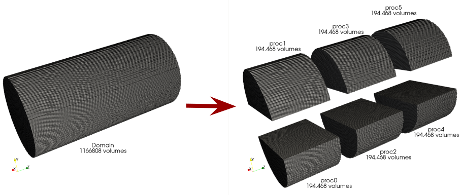
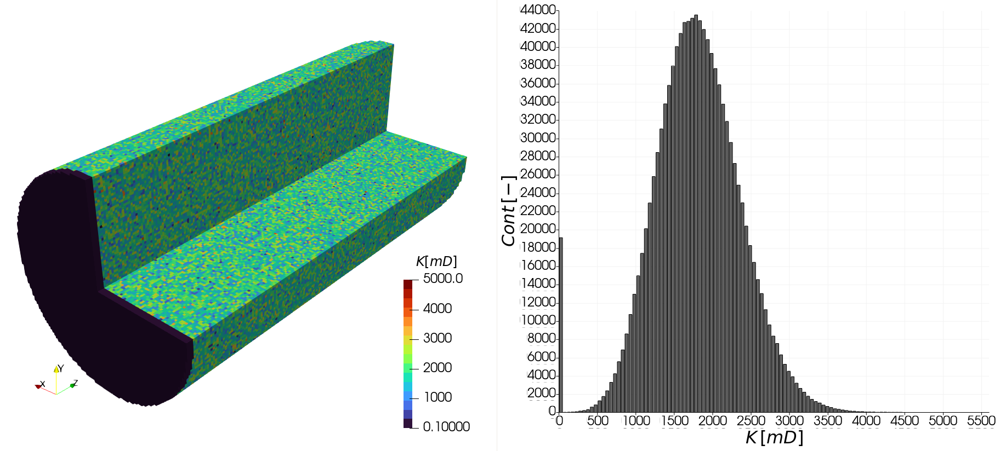
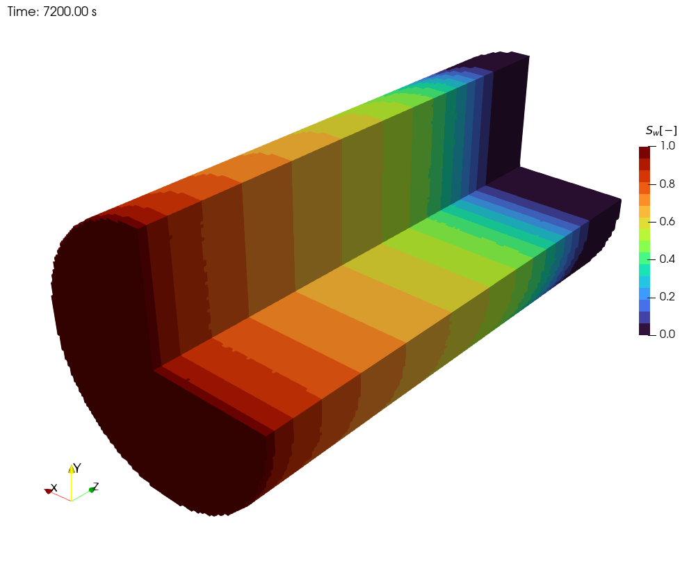

# 📌 Detailed Test Case Documentation: Core case with capillarity effects

## 🎯 Objective

The objective of this test case is to present a real-world application using **`coupledMatrixFoam`**. In this case, we capture the saturation front in an **immiscible two-phase flow (water-oil displacement)** within a **3D heterogeneous** porous medium with **capillarity effects**. This study demonstrates the stability of **`coupledMatrixFoam`** when using large time steps, compared to explicit formulations. Additionally, this case serves as an example of how to use **`coupledMatrixFoam`** in parallel.

---

## ℹ️ How to Use This Guide

This guide provides instructions on setting up, running, and post-processing a **Core case** test case using the **`coupledMatrixFoam`** solver in foam-extend 5.0. Follow the sections in order:

1. **Files Overview** – Understand the main configuration and data files.
2. **Numerical Setup** – See how porosity, permeability, and other parameters are defined.
3. **Case Execution** – Learn how to generate the mesh, run the solver, and clean up.
4. **Post-processing** – Illustrate the time step during simulation.

---

## 📖 Test Case Description

- **Domain:** 3D. Main flow along the Z-axis. The domain is a cylindrical core with a 0.09 m diameter (in the X and Y plane) and a height of 0.183 m (along the Z direction).
- **Porous medium:**  Homogeneous porosity with heterogeneous and isotropic absolute permeability.
- **Initial saturation:** The domain is initially fully saturated with oil (no water present at $t=0$).

This scenario reproduces the conditions of a core flooding experiment, illustrating that the code can capture the water saturation front advancing through a complex porous medium.

---

## 🛠️ Solver Description

The case uses **`coupledMatrixFoam`**, a fully implicit solver based on an Euler-Euler multifluid formulation and Darcy’s law for each phase flowing through the porous medium. Key features include:

- **Implicit coupling** of phase-fraction and pressure equations.
- **Numerical stability** even for relatively large time steps.
- **Based on foam-extend (OpenFOAM) 5.0**.

For more details on the solver’s formulation and block-coupled approach, see the references at the end.

---

## ⚙️ Files Overview

### 1. Initial and Boundary Condition Files (folder `0.orig`)
- **`alpha.oil`** and **`alpha.water`**: Oil and water phases volumetric fractions.
- **`alpha.rock`**: Rock phase volumetric fraction. In this case, it is defined as the complement of porosity ($\alpha_{rock} = 1 - \phi$).
- **`invK.rock.gz`**: Normalized absolute permeability inverse (multiplied by `factor`).
- **`p`**: Normalized pressure field in the domain (multiplied by `factor`).
- **`U.oil`** and **`U.water`**: Oil and water phases interstitial velocities.

### 2. Property Files (folder `constant`)
- **`polyMesh.orig`**: Mesh data for this case.
- **`phaseProperties`**: Physical properties of the phases (density, viscosity), relative permeability model (e.g., Brooks-Corey), and normilized capillary pressure model (also normalized by `factor`).
- **`g`**: Normalized gravity vector (also normalized by `factor`).

### 3. Images used on this README.md (folder `images`)
- **`permeabilityField.png`**: Illustration of the absolute permeability field.
- **`plugPartition.png`**: Illustration of domain decomposition.
- **`waterSaturationField.png`**: Result of the water saturation field.

### 4. Post Processing Files (folder `scripts`)
- **`timeStep.py`**: Python script that creates a figure showing the evolution of time steps throughout the simulation.

### 5. Configuration Files (folder `system`)
- **`controlDict`**: Controls simulation time parameters (start, end, deltaT) and output frequency.
- **`fvSolution`**: Sets tolerances and solvers (e.g., PCG, BiCGStab).
- **`fvSchemes`**: Specifies discretization (grad, div, laplacian) and interpolation schemes.
- **`decomposeParDict`**: dictionary file that controls how the domain is decomposed for parallel processing. The domain will be decomposed as illustrated below:




### 6. Execution Scripts
- **`Allrun`**: Main script that:
  - Restores initial field data from `0.orig`.
  - Extracts the mesh from a `polyMesh.tar.xz` archive.
  - Temporarily renames `diagTensor` fields to `vector` to allow domain decomposition.
  - Runs `decomposePar` to decompose the domain for parallel execution.
  - Restores the `diagTensor` type in the decomposed field files.
  - Executes the solver in parallel on 6 processors using `runParallel $(getApplication)`.
  - Reconstructs the decomposed results into a single unified case with `reconstructPar`.

- **`Allclean`**: Removes previous execution results, cleaning the directory for a new run.

---

## 🔨 Detailed Numerical Setup

### 1. Porous Medium Properties

- **Porosity** ($\phi$): `0.2`
- **Absolute Permeability** ($K$): heterogenous field illustrated in the figure below:



- Defined in `invK.rock` as:
  $$
  invK_{rock} = \frac{1}{K} \times factor \\
  $$
  with a normalization factor of $1\times10^{-8}$. This normalization factor is used to bring the pressure values closer to the phase volume fraction values, as they are being resolved in the coupled nonlinear system.

- The rock volume fraction is defined in `alpha.rock` as:
  $$
  alpha.rock = 1 - \phi \\
  $$

### 2. Relative Permeability Model

A **Brooks-Corey** model consistent with the homogeneous Buckley-Leverett approach was used:

- **Water relative permeability**: $k_{rw} = S_w^2$
- **Oil relative permeability**: $k_{ro} = S_o^2$

This is set on `constant/phaseProperties`.

### 3. Capillarity Model

A **Brooks-Corey** model was used:

$$
  p_{c,ow} = p_{c,0} \left(\frac{\alpha_i}{\alpha_{void}}\right)^{-\beta},\\
$$
where $p_{c,0} = 100 Pa$ and $\beta = 0.5$.

Since the capillary pressure must also be multiplied by $factor$, we set it in `constant/phaseProperties` as follows:

$$
  p_{c,0,normalized} = p_{c,0} \times factor.\\
$$

### 4. Fluid Physical Properties

Water has a density of 1000 kg/m³ and a dynamic viscosity of 0.001 Pa·s, while
 oil has a lower density of 800 kg/m³ and a higher viscosity of 0.002 Pa·s.

These values are typical for laboratory-scale water-oil displacement experiments.
This is set on `constant/phaseProperties`.

### 5. Initial Conditions

- Oil volume fraction (`alpha.oil`) = `0.2`
- Water volume fraction (`alpha.water`) = `0`

Hence, the entire domain is initially 100% oil saturated.

### 6. Boundary Conditions

**Inlet (Z=0 m):**

- A constant **superficial velocity** of water:
  $$
  U_w = 2.61396 \times 10^{-6} \, m/s \\
  $$
- Since the solver uses an interstitial flux in `U.water`, we convert:
  $$
  U_{w, interstitial} = \frac{Q}{\phi} = 1.306984 \times 10^{-5} \frac{\text{m}}{s} \\
  $$

**Outlet (Z=0.183 m):**

- Fixed pressure boundary condition:
  $$
  p_{real} = 101.352972 \times 10^6 \text{Pa} \\
  $$
- Since permeability was normalized, pressure must also be normalized by the same factor:
  $$
  p_{normalized} = p_{real} \times factor \\
  $$

### 7. Gravity

- The gravity vector is set in `constant/g`. Since the permeability and the pressure were normalized, the gravity must also be normalized by the same factor:
  $$
  g_{normalized} = g_{real} \times factor \\
  $$

---

## 🚀 Case Execution

1. **Enable the environment**
   Make sure to run, for example:
   ```bash
   source /path/to/foam-extend-5.0/etc/bashrc
   ```
2. **Run `Allrun`**
  - Restores initial field data from `0.orig`.
  - Extracts the mesh from a `polyMesh.tar.xz` archive.
  - Temporarily renames `diagTensor` fields to `vector` to allow domain decomposition.
  - Runs `decomposePar` to decompose the domain for parallel execution.
  - Restores the `diagTensor` type in the decomposed field files.
  - Executes the solver in parallel on 6 processors using `runParallel $(getApplication)`.
  - Reconstructs the decomposed results into a single unified case with `reconstructPar`.

3. **Clean**
   To remove previous results and start fresh, run:
   ```bash
   ./Allclean
   ```

---

## 📊 Post-processing


- **timeStep.py**
This script processes the simulation log file (log.coupledMatrixFoam) to extract time step values and corresponding simulation times. It computes the average time step, and generates a plot of time step versus simulation time, saving it as deltaT.png.

- Using `ParaView` one can obtain the saturation profile on the domain:


<div></div>

---

## 🧮 Model Equations (Summary)

1. **Darcy’s Law for phase $i$**:
   $$
   \alpha_i U_i = -\frac{k_{r,i}}{\mu_i} K (\nabla p_i - \rho_i g)\\
   $$
2. **Phase Mass Conservation**:
   $$
   \frac{\partial \alpha_i}{\partial t} + \nabla \cdot (\alpha_i U_i) = 0\\
   $$
3. **Closure condition**:
   $$
   \sum_{i=1}^{n} \alpha_i = 1\\
   $$

---

## 🏁 Conclusion

This study demonstrates the stability of **`coupledMatrixFoam`** when using large time steps, compared to explicit formulations. Additionally, this case serves as an example of how to use **`coupledMatrixFoam`** in parallel.

---

## 📑 References

- **Lange, R. et al. (2025).** *coupledMatrixFoam: an advanced fully-implicit solver for heterogeneous porous media based on foam-extend*.
